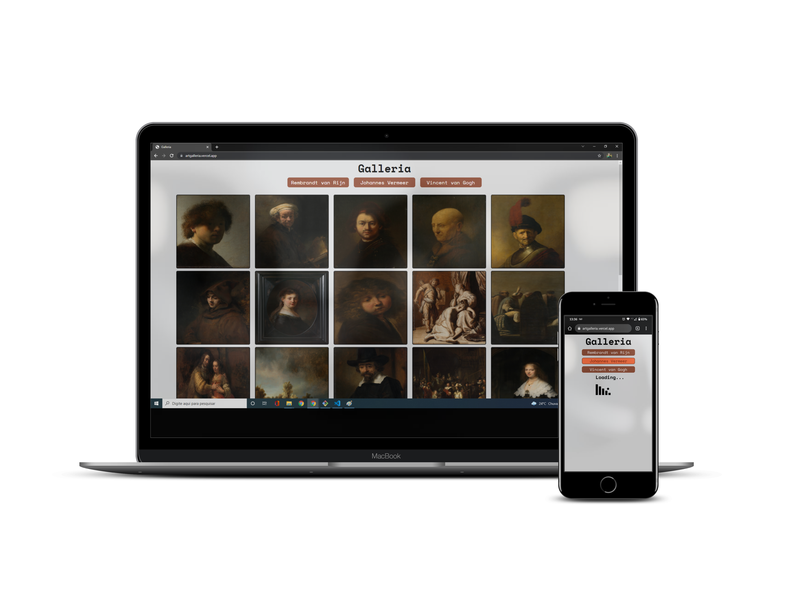
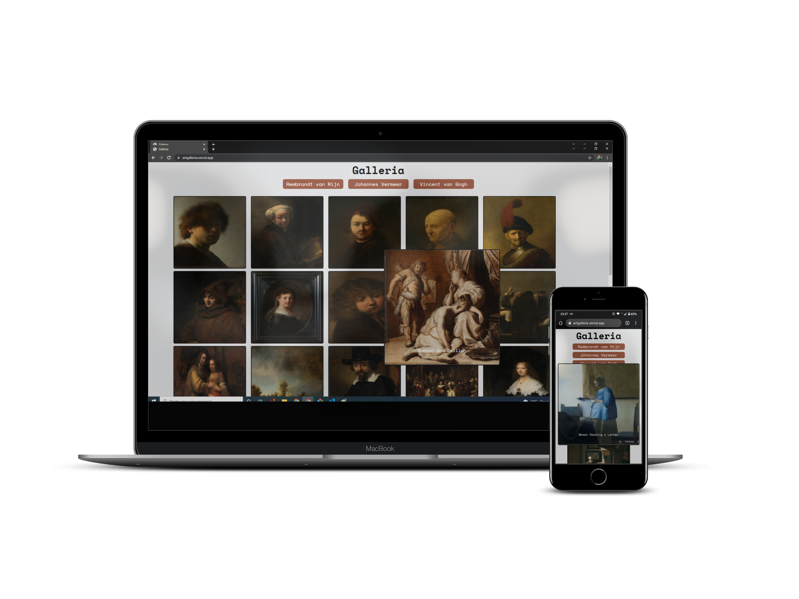

# Art Galleria

This is a art gallery from Rijksmuseum API based on Galleria slideshow site from [Frontend Mentor](https://www.frontendmentor.io/challenges/galleria-slideshow-site-tEA4pwsa6).

## Table of contents

- [Art Galleria](#art-galleria)
  - [Table of contents](#table-of-contents)
  - [Overview](#overview)
    - [The challenge](#the-challenge)
    - [Screnshot](#screnshot)
    - [Links](#links)
  - [My process](#my-process)
    - [Built with](#built-with)
    - [What I learn](#what-i-learn)
  - [Author](#author)
    - [Get in touch](#get-in-touch)

## Overview

### The challenge

Users should be able to:

- View the optimal layout for the app depending on their device's screen size
- See hover states for all interactive elements on the page
- See the title of masterpiece

### Screnshot

### Links

-  Enjoy my project: [Art Gelleria](https://artgalleria.vercel.app/)

## My process

### Built with

- HTML5
- CSS3
- SCSS
- Javascript
- React JS

### What I learn

  I put into practice my knowledge of HTML5 and CSS3 to develop this application, using semantic tags and media query to style the mobile version. In addition, I put my previous knowledge of Javascript into practice. Improved skills in React, such as using useState.
On the backend I improved my skills in Express and Axios.
Also, using the [Rijskmusem API](https://data.rijksmuseum.nl/object-metadata/api/) I learned more about integrating with an external API.

## Author

### Get in touch
- Portfolio - [Gabriel Moura](https://gcmoura-portfolio.netlify.app/)
- Linkedin - [Gabriel Moura](https://www.linkedin.com/in/gabriel-moura-developer/)
- Github - [@GCMoura](https://github.com/GCMoura)